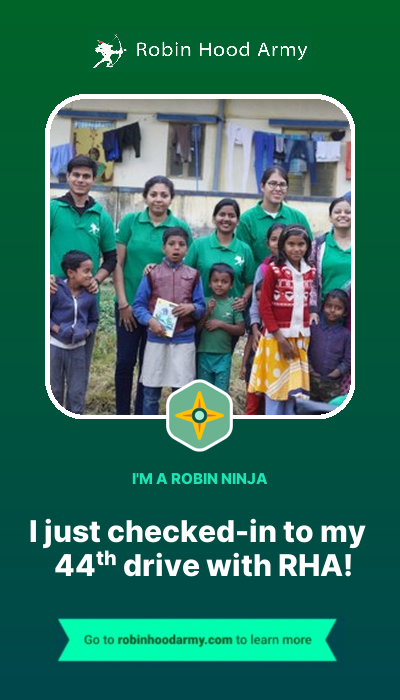

# RHA-photo-sharing decoration

This Python script uses the `Pillow` library to create a rounded rectangle image. It adds a rounded rectangle border, an image fetched from Unsplash, and text on top of the image.

# How to Run

1. Install the required packages by running `pip install Pillow requests`.
2. Run the script using the command `python app.py`.

# Usage

By default, the script fetches a random image from Unsplash and adds a border and text on top of it. You can customize the following settings by modifying the variables in the script:

- `padding`: The distance between the image and the border.
- `border_radius`: The radius of the rounded corners of the border.
- `fill_color`: The color of the border.
- `text`: The text to display on the image.
- `font`: The font and size of the text.

After running the script, the generated image will be saved in the same directory with the filename `decorated_image.png`.
--- 
### decorated_image

